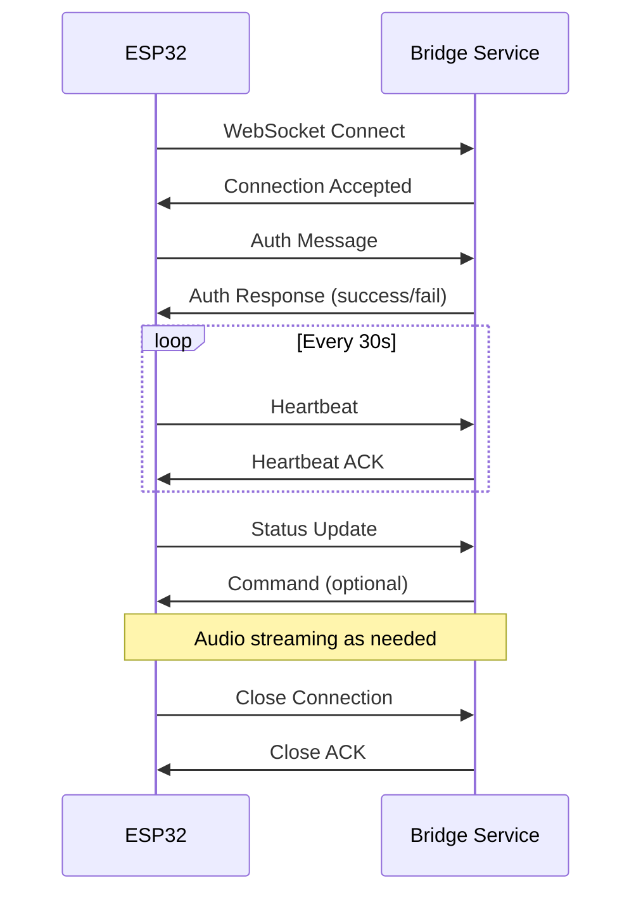

# WebSocket Protocol

## Connection

### ESP32 Connection

```
ws://bridge-host:8080/ws/esp32
```

Headers:

```
X-Device-Token: <device_token>
X-Device-ID: <device_id>
```

### Webapp Connection

```
ws://bridge-host:8080/ws/client
```

Headers:

```
Authorization: Bearer <jwt_token>
```

## Message Format

All messages are JSON:

```typescript
interface Message {
  type: string;
  payload: any;
  timestamp: number;
  messageId: string;
}
```

## Message Types

### From ESP32

#### Authentication

```json
{
  "type": "auth",
  "payload": {
    "deviceId": "esp32-001",
    "deviceToken": "xxx",
    "firmwareVersion": "0.1.0"
  },
  "timestamp": 1704067200000,
  "messageId": "msg-001"
}
```

#### Audio Stream

```json
{
  "type": "audio",
  "payload": {
    "format": "pcm",
    "sampleRate": 16000,
    "bitsPerSample": 16,
    "channels": 1,
    "chunk": "base64-encoded-audio-data",
    "sequence": 1,
    "final": false
  },
  "timestamp": 1704067200000,
  "messageId": "msg-002"
}
```

#### Status Update

```json
{
  "type": "status",
  "payload": {
    "wifiStrength": -45,
    "isRecording": false,
    "isPlaying": false,
    "freeHeap": 150000
  },
  "timestamp": 1704067200000,
  "messageId": "msg-003"
}
```

#### Heartbeat

```json
{
  "type": "heartbeat",
  "payload": {},
  "timestamp": 1704067200000,
  "messageId": "msg-004"
}
```

### To ESP32

#### Authentication Response

```json
{
  "type": "auth_response",
  "payload": {
    "success": true,
    "sessionId": "session-123"
  },
  "timestamp": 1704067200000,
  "messageId": "msg-005"
}
```

#### Audio Playback

```json
{
  "type": "audio",
  "payload": {
    "format": "mp3",
    "sampleRate": 22050,
    "chunk": "base64-encoded-audio-data",
    "sequence": 1,
    "final": false
  },
  "timestamp": 1704067200000,
  "messageId": "msg-006"
}
```

#### Command

```json
{
  "type": "command",
  "payload": {
    "command": "start_recording",
    "params": {}
  },
  "timestamp": 1704067200000,
  "messageId": "msg-007"
}
```

Available commands:

- `start_recording` - Start audio capture
- `stop_recording` - Stop audio capture
- `play` - Start audio playback
- `stop` - Stop audio playback
- `configure` - Update device configuration
- `restart` - Restart device
- `ota_update` - Start OTA update

#### Error

```json
{
  "type": "error",
  "payload": {
    "code": "AUDIO_ERROR",
    "message": "Failed to process audio"
  },
  "timestamp": 1704067200000,
  "messageId": "msg-008"
}
```

## Connection Lifecycle



## Error Codes

| Code            | Description            |
| --------------- | ---------------------- |
| AUTH_FAILED     | Authentication failed  |
| INVALID_MESSAGE | Malformed message      |
| RATE_LIMITED    | Too many messages      |
| AUDIO_ERROR     | Audio processing error |
| DEVICE_BUSY     | Device is busy         |
| SESSION_EXPIRED | Session has expired    |

## Reconnection

On disconnect:

1. Wait 1 second
2. Attempt reconnection
3. On failure, exponential backoff (max 30s)
4. Re-authenticate on success
