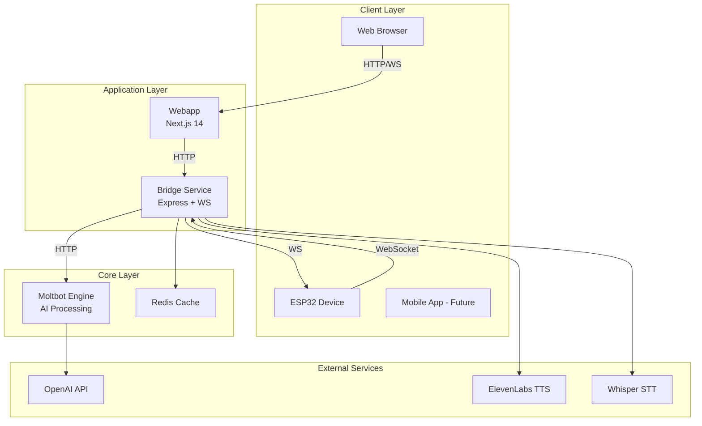

# UE-Bot System Architecture

## Overview

UE-Bot là một AI assistant platform kết hợp:

- **Moltbot/Clawdbot Core**: Multi-channel AI assistant engine
- **Custom Webapp**: Web-based control panel và chat interface
- **ESP32 Voice Module**: Hardware voice input/output

## High-Level Architecture

## Components

| Component      | Technology              | Purpose                               |
| -------------- | ----------------------- | ------------------------------------- |
| Webapp         | Next.js 14, TailwindCSS | User interface, dashboard             |
| Bridge Service | Express.js, WebSocket   | ESP32 communication, audio processing |
| Moltbot        | Node.js                 | AI processing, multi-channel support  |
| ESP32 Firmware | C++, Arduino            | Voice capture, audio playback         |
| Redis          | Redis 7                 | Session cache, real-time state        |

## Key Design Principles

1. **Modularity**: Mỗi component có thể deploy độc lập
2. **Scalability**: Bridge service có thể scale horizontal
3. **Reliability**: Auto-reconnect, graceful degradation
4. **Security**: Auth tokens, encrypted connections
5. **Real-time**: WebSocket cho low-latency communication

## Documentation Index

- [System Design](./system-design.md) - Chi tiết kiến trúc
- [Data Flow](./data-flow.md) - Luồng dữ liệu
- [API Docs](../api/) - API specifications
- [Guides](../guides/) - Hướng dẫn sử dụng
