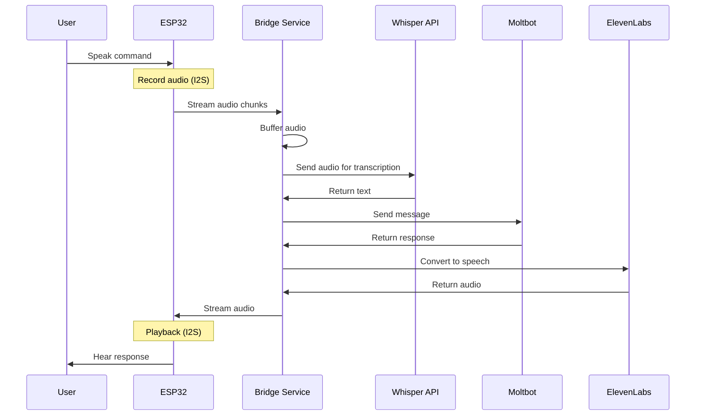
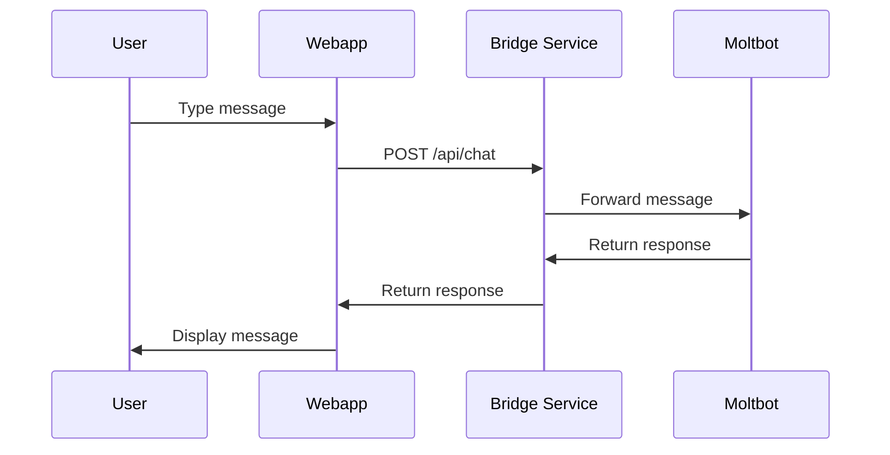
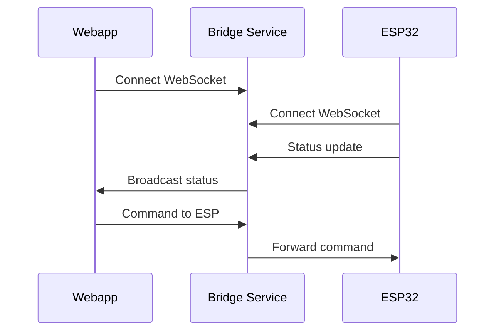
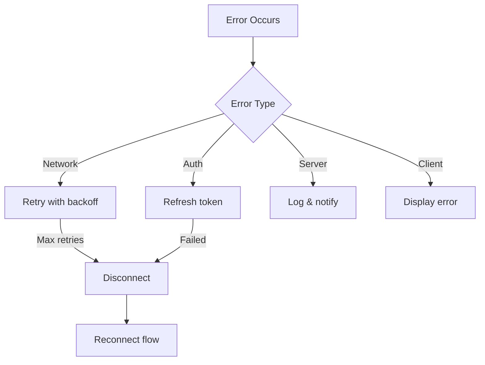

# Data Flow Documentation

## 1. Voice Command Flow



## 2. Web Chat Flow



## 3. Real-time Update Flow



## 4. Audio Streaming Protocol

### ESP32 → Bridge (Voice Input)

```
┌──────────────────────────────────────────┐
│           WebSocket Message               │
├──────────────────────────────────────────┤
│ type: "audio"                            │
│ data: {                                  │
│   format: "pcm",                         │
│   sampleRate: 16000,                     │
│   bitsPerSample: 16,                     │
│   channels: 1,                           │
│   chunk: <base64 encoded audio>          │
│ }                                        │
└──────────────────────────────────────────┘
```

### Bridge → ESP32 (Voice Output)

```
┌──────────────────────────────────────────┐
│           WebSocket Message               │
├──────────────────────────────────────────┤
│ type: "audio"                            │
│ data: {                                  │
│   format: "mp3" | "pcm",                 │
│   sampleRate: 22050,                     │
│   chunk: <base64 encoded audio>,         │
│   sequence: 1,                           │
│   final: false                           │
│ }                                        │
└──────────────────────────────────────────┘
```

## 5. State Management

### Device State

```typescript
interface DeviceState {
  deviceId: string;
  status: 'online' | 'offline' | 'busy';
  lastSeen: Date;
  firmwareVersion: string;
  wifiStrength: number;
  isRecording: boolean;
  isPlaying: boolean;
}
```

### Session State

```typescript
interface SessionState {
  sessionId: string;
  userId: string;
  deviceId?: string;
  conversationHistory: Message[];
  createdAt: Date;
  lastActivity: Date;
}
```

## 6. Error Handling Flow



## 7. Message Types

### WebSocket Message Format

```typescript
interface WSMessage {
  type: MessageType;
  payload: unknown;
  timestamp: number;
  messageId: string;
}

type MessageType = 'audio' | 'text' | 'command' | 'status' | 'error' | 'heartbeat';
```

### Audio Message Payload

```typescript
interface AudioPayload {
  format: 'pcm' | 'mp3' | 'wav';
  sampleRate: number;
  bitsPerSample: number;
  channels: number;
  chunk: string; // base64
  sequence?: number;
  final?: boolean;
}
```

### Command Payload

```typescript
interface CommandPayload {
  command: 'start_recording' | 'stop_recording' | 'play' | 'stop' | 'configure';
  params?: Record<string, unknown>;
}
```
