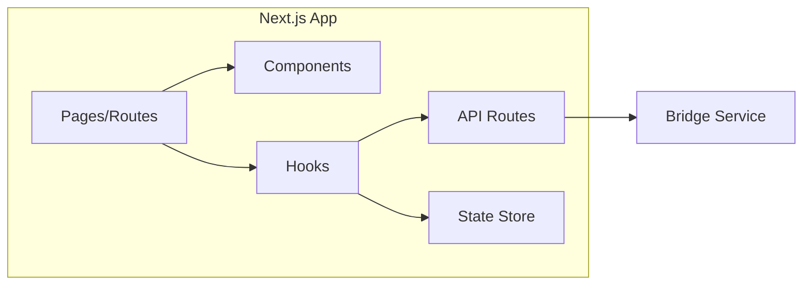
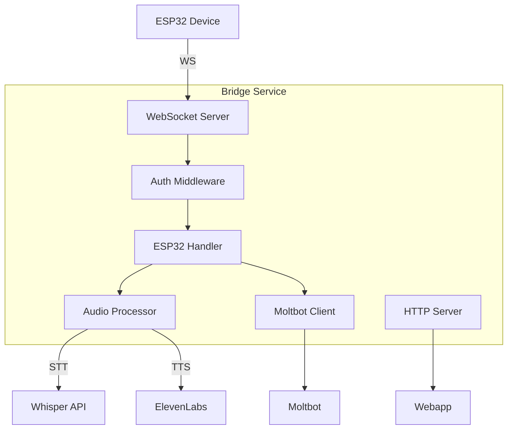
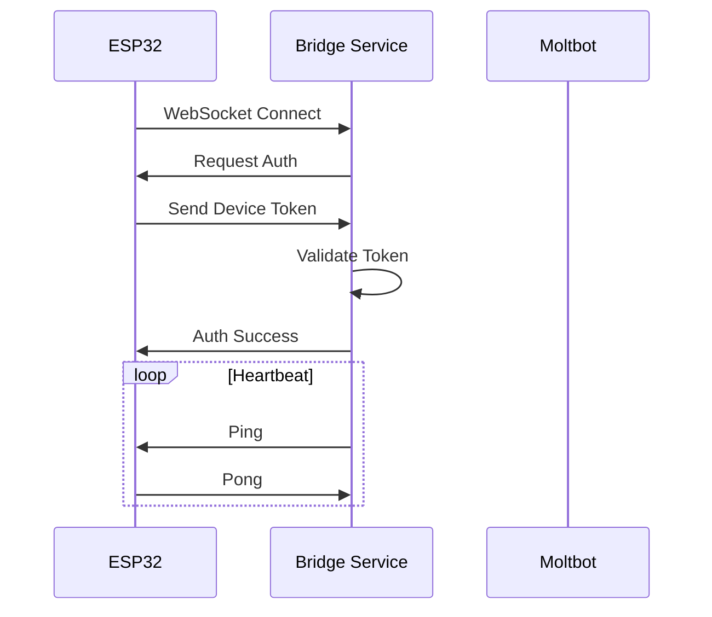
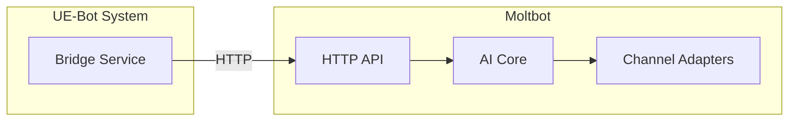
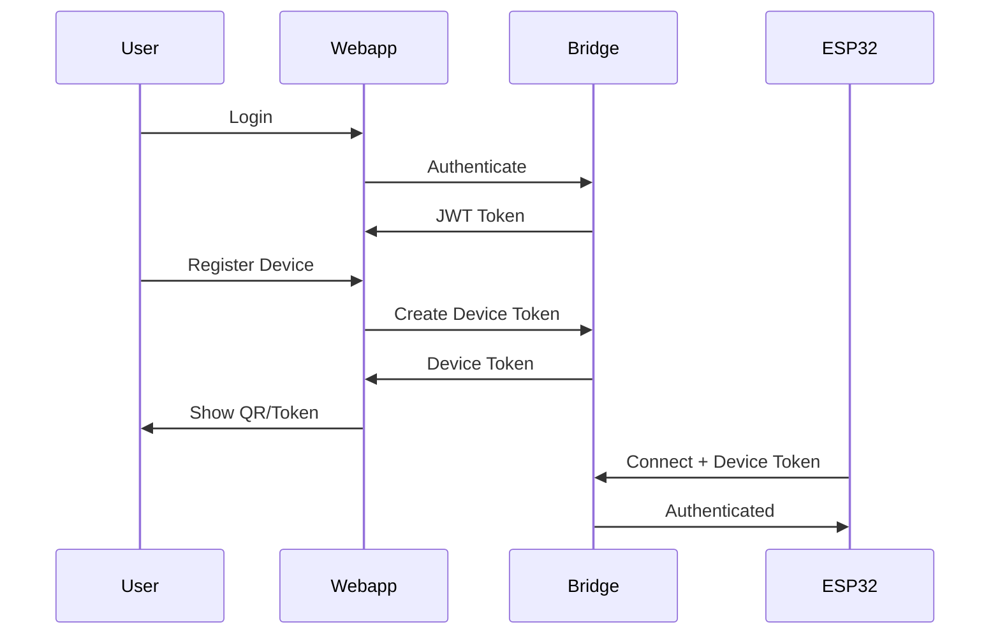

# System Design Document

## 1. Webapp (packages/webapp)

### Purpose

Web-based control panel và chat interface cho UE-Bot.

### Technology Stack

- **Framework**: Next.js 14 (App Router)
- **UI**: TailwindCSS, Shadcn/UI
- **State**: Zustand
- **Data Fetching**: TanStack Query
- **Real-time**: WebSocket via Socket.io-client

### Key Features

- Dashboard với system status
- Chat interface với AI
- Device management (ESP32)
- Settings & configuration
- Conversation history

### Architecture



---

## 2. Bridge Service (packages/bridge-service)

### Purpose

Middleware service kết nối ESP32 với Moltbot, xử lý audio.

### Technology Stack

- **Runtime**: Node.js 22
- **Framework**: Express.js
- **WebSocket**: ws library
- **Audio**: node-opus, wav

### Key Features

- WebSocket server cho ESP32
- Audio stream processing
- Speech-to-Text relay (Whisper)
- Text-to-Speech relay (ElevenLabs)
- Device authentication
- Health monitoring

### Architecture



### Connection Flow



---

## 3. ESP32 Firmware (packages/esp32-firmware)

### Purpose

Voice input/output hardware interface.

### Technology Stack

- **Platform**: ESP32-S3 (recommended)
- **Framework**: Arduino + PlatformIO
- **Audio**: I2S (INMP441 + MAX98357A)
- **Network**: WiFi + WebSocket

### Key Features

- WiFi connection với auto-reconnect
- WebSocket client
- I2S audio capture (16-bit, 16kHz)
- I2S audio playback
- Wake word detection (optional)
- LED status indicators

### Hardware Architecture

```
┌─────────────────────────────────────────┐
│              ESP32-S3                    │
│                                          │
│  ┌──────────────────────────────────┐   │
│  │           I2S Bus 0              │   │
│  │  ┌─────────────┐                 │   │
│  │  │  INMP441    │ → Audio In      │   │
│  │  │  Microphone │                 │   │
│  │  └─────────────┘                 │   │
│  └──────────────────────────────────┘   │
│                                          │
│  ┌──────────────────────────────────┐   │
│  │           I2S Bus 1              │   │
│  │  ┌─────────────┐                 │   │
│  │  │  MAX98357A  │ ← Audio Out     │   │
│  │  │  DAC+Amp    │                 │   │
│  │  └─────────────┘                 │   │
│  └──────────────────────────────────┘   │
│                                          │
│  ┌──────────┐  ┌──────────┐             │
│  │   WiFi   │  │   LED    │             │
│  └──────────┘  └──────────┘             │
└─────────────────────────────────────────┘
```

---

## 4. Moltbot Integration

### Integration Points



### Communication Protocol

1. Bridge gửi text message tới Moltbot API
2. Moltbot xử lý và trả response
3. Bridge convert response thành audio (nếu cần)
4. Bridge stream audio tới ESP32

---

## 5. Security Architecture

### Authentication Flow



### Security Measures

- JWT for user authentication
- Device tokens for ESP32
- TLS encryption for all connections
- Rate limiting
- Input validation
- CORS configuration

---

## 6. Scalability Considerations

### Horizontal Scaling

```
                    ┌─────────────────┐
                    │  Load Balancer  │
                    └────────┬────────┘
                             │
         ┌───────────────────┼───────────────────┐
         │                   │                   │
    ┌────▼────┐        ┌─────▼────┐        ┌────▼────┐
    │ Bridge  │        │ Bridge   │        │ Bridge  │
    │   #1    │        │   #2     │        │   #3    │
    └────┬────┘        └────┬─────┘        └────┬────┘
         │                  │                   │
         └──────────────────┼───────────────────┘
                            │
                    ┌───────▼───────┐
                    │    Redis      │
                    │ (Pub/Sub)     │
                    └───────────────┘
```

### Performance Targets

- WebSocket latency: < 50ms
- Audio processing: < 200ms
- End-to-end voice: < 2s
- Concurrent ESP32 devices: 100+ per instance
