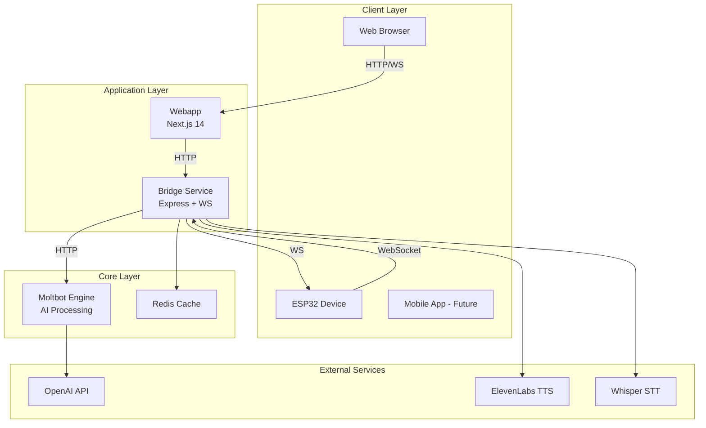
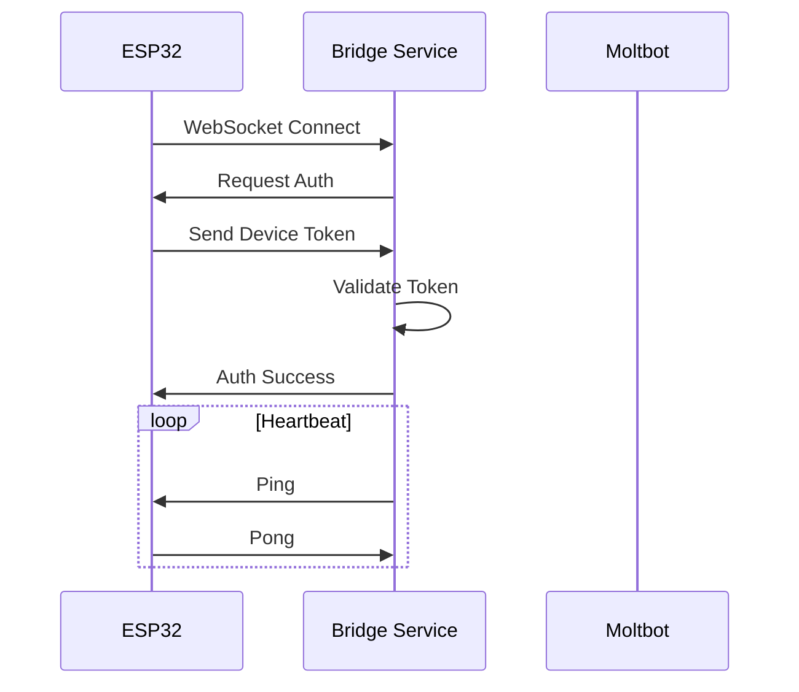
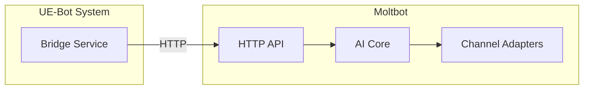
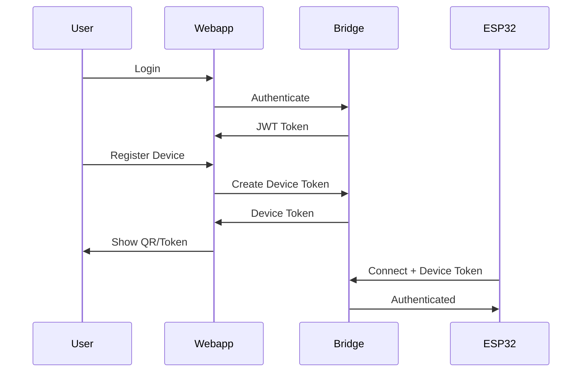
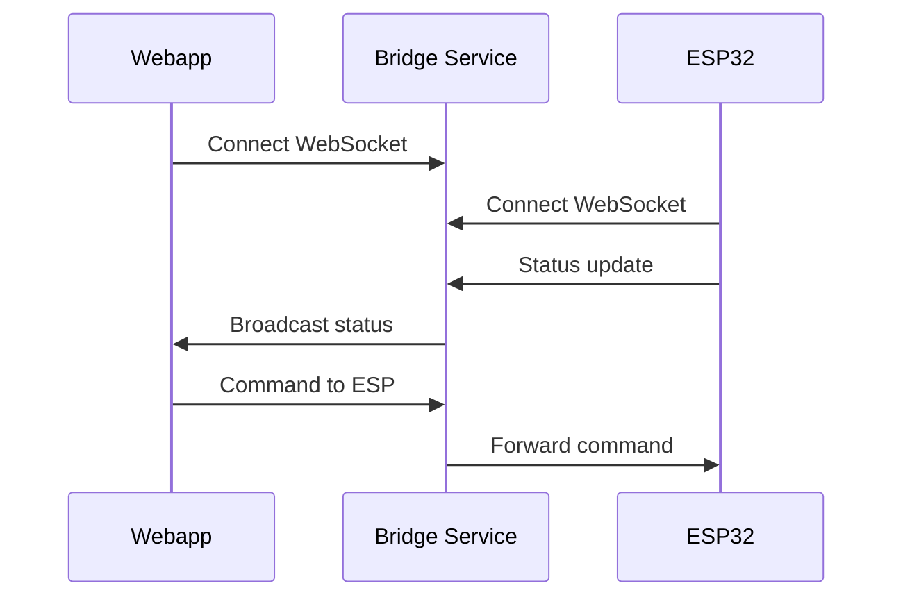
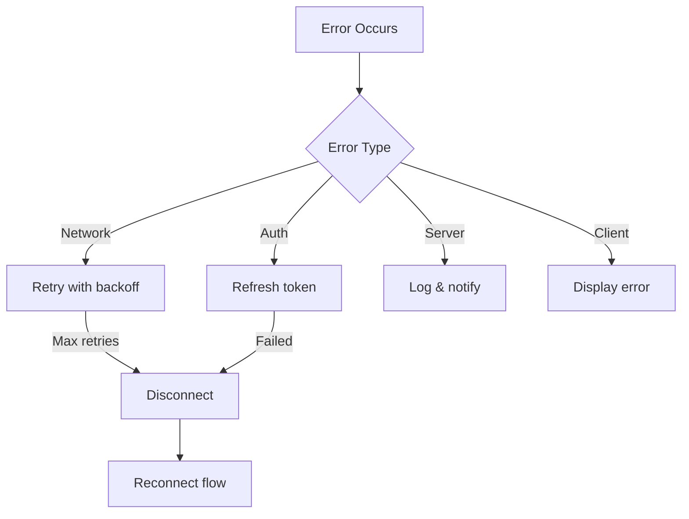

# TASK-011: Write Architecture Documentation

## Task Information

- **ID**: T011
- **Phase**: 1 - Foundation
- **Priority**: Medium
- **Estimated Hours**: 2h
- **Dependencies**: T001-T007

---

## Objective

Tạo tài liệu kiến trúc hệ thống chi tiết để các developer hiểu rõ cách hệ thống hoạt động.

---

## Acceptance Criteria

- [ ] System architecture diagram (Mermaid)
- [ ] Component descriptions
- [ ] Data flow documentation
- [ ] API specifications outline
- [ ] Security considerations

---

## Instructions

### Step 1: Create Documentation Directory

```
docs/
├── architecture/
│   ├── README.md (overview)
│   ├── system-design.md
│   ├── data-flow.md
│   └── diagrams/
│       └── (mermaid diagrams embedded in md)
├── api/
│   ├── webapp-api.md
│   ├── bridge-api.md
│   └── websocket-protocol.md
├── guides/
│   ├── getting-started.md
│   ├── development.md
│   ├── deployment.md
│   └── esp32-setup.md
└── decisions/
    └── adr-001-tech-stack.md
```

### Step 2: Create Architecture Overview

**File: `docs/architecture/README.md`**

````markdown
# UE-Bot System Architecture

## Overview

UE-Bot là một AI assistant platform kết hợp:

- **Moltbot/Clawdbot Core**: Multi-channel AI assistant engine
- **Custom Webapp**: Web-based control panel và chat interface
- **ESP32 Voice Module**: Hardware voice input/output

## High-Level Architecture


````

## Components

| Component      | Technology              | Purpose                               |
| -------------- | ----------------------- | ------------------------------------- |
| Webapp         | Next.js 14, TailwindCSS | User interface, dashboard             |
| Bridge Service | Express.js, WebSocket   | ESP32 communication, audio processing |
| Moltbot        | Node.js                 | AI processing, multi-channel support  |
| ESP32 Firmware | C++, Arduino            | Voice capture, audio playback         |
| Redis          | Redis 7                 | Session cache, real-time state        |

## Key Design Principles

1. **Modularity**: Mỗi component có thể deploy độc lập
2. **Scalability**: Bridge service có thể scale horizontal
3. **Reliability**: Auto-reconnect, graceful degradation
4. **Security**: Auth tokens, encrypted connections
5. **Real-time**: WebSocket cho low-latency communication

## Documentation Index

- [System Design](./system-design.md) - Chi tiết kiến trúc
- [Data Flow](./data-flow.md) - Luồng dữ liệu
- [API Docs](../api/) - API specifications
- [Guides](../guides/) - Hướng dẫn sử dụng

````

### Step 3: Create System Design Document

**File: `docs/architecture/system-design.md`**
```markdown
# System Design Document

## 1. Webapp (packages/webapp)

### Purpose
Web-based control panel và chat interface cho UE-Bot.

### Technology Stack
- **Framework**: Next.js 14 (App Router)
- **UI**: TailwindCSS, Shadcn/UI
- **State**: Zustand
- **Data Fetching**: TanStack Query
- **Real-time**: WebSocket via Socket.io-client

### Key Features
- Dashboard với system status
- Chat interface với AI
- Device management (ESP32)
- Settings & configuration
- Conversation history

### Architecture
```mermaid
graph LR
    subgraph "Next.js App"
        PAGES[Pages/Routes]
        API[API Routes]
        COMP[Components]
        HOOKS[Hooks]
        STORE[State Store]
    end

    PAGES --> COMP
    PAGES --> HOOKS
    HOOKS --> STORE
    HOOKS --> API
    API --> BRIDGE[Bridge Service]
````

---

## 2. Bridge Service (packages/bridge-service)

### Purpose

Middleware service kết nối ESP32 với Moltbot, xử lý audio.

### Technology Stack

- **Runtime**: Node.js 22
- **Framework**: Express.js
- **WebSocket**: ws library
- **Audio**: node-opus, wav

### Key Features

- WebSocket server cho ESP32
- Audio stream processing
- Speech-to-Text relay (Whisper)
- Text-to-Speech relay (ElevenLabs)
- Device authentication
- Health monitoring

### Architecture

```mermaid
graph TB
    subgraph "Bridge Service"
        HTTP[HTTP Server]
        WS[WebSocket Server]
        AUTH[Auth Middleware]
        ESP_HANDLER[ESP32 Handler]
        AUDIO[Audio Processor]
        MOLTBOT_CLIENT[Moltbot Client]
    end

    ESP32[ESP32 Device] -->|WS| WS
    WS --> AUTH
    AUTH --> ESP_HANDLER
    ESP_HANDLER --> AUDIO
    AUDIO -->|STT| WHISPER[Whisper API]
    AUDIO -->|TTS| ELEVEN[ElevenLabs]
    ESP_HANDLER --> MOLTBOT_CLIENT
    MOLTBOT_CLIENT --> MOLTBOT[Moltbot]
    HTTP --> WEBAPP[Webapp]
```

### Connection Flow



---

## 3. ESP32 Firmware (packages/esp32-firmware)

### Purpose

Voice input/output hardware interface.

### Technology Stack

- **Platform**: ESP32-S3 (recommended)
- **Framework**: Arduino + PlatformIO
- **Audio**: I2S (INMP441 + MAX98357A)
- **Network**: WiFi + WebSocket

### Key Features

- WiFi connection với auto-reconnect
- WebSocket client
- I2S audio capture (16-bit, 16kHz)
- I2S audio playback
- Wake word detection (optional)
- LED status indicators

### Hardware Architecture

```
┌─────────────────────────────────────────┐
│              ESP32-S3                    │
│                                          │
│  ┌──────────────────────────────────┐   │
│  │           I2S Bus 0              │   │
│  │  ┌─────────────┐                 │   │
│  │  │  INMP441    │ → Audio In      │   │
│  │  │  Microphone │                 │   │
│  │  └─────────────┘                 │   │
│  └──────────────────────────────────┘   │
│                                          │
│  ┌──────────────────────────────────┐   │
│  │           I2S Bus 1              │   │
│  │  ┌─────────────┐                 │   │
│  │  │  MAX98357A  │ ← Audio Out     │   │
│  │  │  DAC+Amp    │                 │   │
│  │  └─────────────┘                 │   │
│  └──────────────────────────────────┘   │
│                                          │
│  ┌──────────┐  ┌──────────┐             │
│  │   WiFi   │  │   LED    │             │
│  └──────────┘  └──────────┘             │
└─────────────────────────────────────────┘
```

---

## 4. Moltbot Integration

### Integration Points



### Communication Protocol

1. Bridge gửi text message tới Moltbot API
2. Moltbot xử lý và trả response
3. Bridge convert response thành audio (nếu cần)
4. Bridge stream audio tới ESP32

---

## 5. Security Architecture

### Authentication Flow



### Security Measures

- JWT for user authentication
- Device tokens for ESP32
- TLS encryption for all connections
- Rate limiting
- Input validation
- CORS configuration

---

## 6. Scalability Considerations

### Horizontal Scaling

```
                    ┌─────────────────┐
                    │  Load Balancer  │
                    └────────┬────────┘
                             │
         ┌───────────────────┼───────────────────┐
         │                   │                   │
    ┌────▼────┐        ┌─────▼────┐        ┌────▼────┐
    │ Bridge  │        │ Bridge   │        │ Bridge  │
    │   #1    │        │   #2     │        │   #3    │
    └────┬────┘        └────┬─────┘        └────┬────┘
         │                  │                   │
         └──────────────────┼───────────────────┘
                            │
                    ┌───────▼───────┐
                    │    Redis      │
                    │ (Pub/Sub)     │
                    └───────────────┘
```

### Performance Targets

- WebSocket latency: < 50ms
- Audio processing: < 200ms
- End-to-end voice: < 2s
- Concurrent ESP32 devices: 100+ per instance

````

### Step 4: Create Data Flow Document

**File: `docs/architecture/data-flow.md`**
```markdown
# Data Flow Documentation

## 1. Voice Command Flow

```mermaid
sequenceDiagram
    participant User as User
    participant ESP as ESP32
    participant Bridge as Bridge Service
    participant STT as Whisper API
    participant Moltbot as Moltbot
    participant TTS as ElevenLabs

    User->>ESP: Speak command
    Note over ESP: Record audio (I2S)
    ESP->>Bridge: Stream audio chunks
    Bridge->>Bridge: Buffer audio
    Bridge->>STT: Send audio for transcription
    STT->>Bridge: Return text
    Bridge->>Moltbot: Send message
    Moltbot->>Bridge: Return response
    Bridge->>TTS: Convert to speech
    TTS->>Bridge: Return audio
    Bridge->>ESP: Stream audio
    Note over ESP: Playback (I2S)
    ESP->>User: Hear response
````

## 2. Web Chat Flow

```mermaid
sequenceDiagram
    participant User as User
    participant Webapp as Webapp
    participant Bridge as Bridge Service
    participant Moltbot as Moltbot

    User->>Webapp: Type message
    Webapp->>Bridge: POST /api/chat
    Bridge->>Moltbot: Forward message
    Moltbot->>Bridge: Return response
    Bridge->>Webapp: Return response
    Webapp->>User: Display message
```

## 3. Real-time Update Flow



## 4. Audio Streaming Protocol

### ESP32 → Bridge (Voice Input)

```
┌──────────────────────────────────────────┐
│           WebSocket Message               │
├──────────────────────────────────────────┤
│ type: "audio"                            │
│ data: {                                  │
│   format: "pcm",                         │
│   sampleRate: 16000,                     │
│   bitsPerSample: 16,                     │
│   channels: 1,                           │
│   chunk: <base64 encoded audio>          │
│ }                                        │
└──────────────────────────────────────────┘
```

### Bridge → ESP32 (Voice Output)

```
┌──────────────────────────────────────────┐
│           WebSocket Message               │
├──────────────────────────────────────────┤
│ type: "audio"                            │
│ data: {                                  │
│   format: "mp3" | "pcm",                 │
│   sampleRate: 22050,                     │
│   chunk: <base64 encoded audio>,         │
│   sequence: 1,                           │
│   final: false                           │
│ }                                        │
└──────────────────────────────────────────┘
```

## 5. State Management

### Device State

```typescript
interface DeviceState {
  deviceId: string;
  status: "online" | "offline" | "busy";
  lastSeen: Date;
  firmwareVersion: string;
  wifiStrength: number;
  isRecording: boolean;
  isPlaying: boolean;
}
```

### Session State

```typescript
interface SessionState {
  sessionId: string;
  userId: string;
  deviceId?: string;
  conversationHistory: Message[];
  createdAt: Date;
  lastActivity: Date;
}
```

## 6. Error Handling Flow



````

### Step 5: Create Getting Started Guide

**File: `docs/guides/getting-started.md`**
```markdown
# Getting Started Guide

## Prerequisites

- Node.js 22+
- pnpm 9+
- Docker & Docker Compose (optional)
- Git

### Hardware (for voice features)
- ESP32-S3 DevKit
- INMP441 I2S Microphone
- MAX98357A I2S DAC + Speaker

## Quick Start

### 1. Clone Repository

```bash
git clone https://github.com/DuongThanhTaii/UE-Bot.git
cd UE-Bot
````

### 2. Install Dependencies

```bash
pnpm install
```

### 3. Configure Environment

```bash
cp .env.example .env.local
```

Edit `.env.local` with your API keys:

```
OPENAI_API_KEY=your_openai_key
ELEVENLABS_API_KEY=your_elevenlabs_key
```

### 4. Start Development

```bash
# Start all services
pnpm dev

# Or start individually
pnpm --filter @ue-bot/webapp dev        # http://localhost:3000
pnpm --filter @ue-bot/bridge-service dev # http://localhost:8080
```

### 5. Access Application

- Webapp: http://localhost:3000
- Bridge API: http://localhost:8080
- API Health: http://localhost:8080/health

## Project Structure

```
.
├── packages/
│   ├── webapp/           # Next.js frontend
│   ├── bridge-service/   # Express backend
│   ├── shared/           # Shared types & utils
│   └── esp32-firmware/   # ESP32 Arduino code
├── external/
│   └── moltbot/          # Moltbot submodule
├── docs/                 # Documentation
└── tasks/                # Task definitions
```

## Next Steps

1. [Development Guide](./development.md)
2. [ESP32 Setup](./esp32-setup.md)
3. [Deployment Guide](./deployment.md)

````

### Step 6: Create ADR Template

**File: `docs/decisions/adr-001-tech-stack.md`**
```markdown
# ADR 001: Technology Stack Selection

## Status
Accepted

## Date
2024-01-XX

## Context
Cần chọn technology stack cho UE-Bot project với các yêu cầu:
- Clone và mở rộng Moltbot
- Custom web interface
- ESP32 voice integration
- Real-time communication
- Easy deployment

## Decision

### Frontend: Next.js 14 + TailwindCSS + Shadcn/UI
**Reasons:**
- Server-side rendering cho SEO và performance
- App Router cho routing hiện đại
- TailwindCSS cho rapid styling
- Shadcn/UI cho consistent components

### Backend Bridge: Express.js + WebSocket
**Reasons:**
- Lightweight và flexible
- Native WebSocket support
- Easy integration với Moltbot
- Wide ecosystem

### ESP32 Platform: PlatformIO + Arduino
**Reasons:**
- Familiar Arduino ecosystem
- Good IDE support
- Large community
- Easy library management

### Monorepo: pnpm Workspaces
**Reasons:**
- Fast package installation
- Built-in workspace support
- Disk efficient
- Strict dependency management

## Consequences

### Positive
- Modern, well-supported stack
- Good developer experience
- Scalable architecture
- Easy to find developers

### Negative
- Learning curve for Next.js App Router
- TypeScript everywhere requires discipline
- Multiple deployment targets

## References
- [Next.js Documentation](https://nextjs.org/docs)
- [PlatformIO Documentation](https://docs.platformio.org)
- [pnpm Workspaces](https://pnpm.io/workspaces)
````

---

## Verification Checklist

- [ ] All documentation files created
- [ ] Mermaid diagrams render correctly
- [ ] Links between documents work
- [ ] Code examples are accurate
- [ ] Getting started guide tested

---

## Git Commit

```bash
git add .
git commit -m "docs: add system architecture documentation [T011]"
git push
```

---

## Notes

- Update docs khi có thay đổi architecture
- Mermaid diagrams có thể view trong GitHub
- ADRs capture quan trọng architectural decisions
